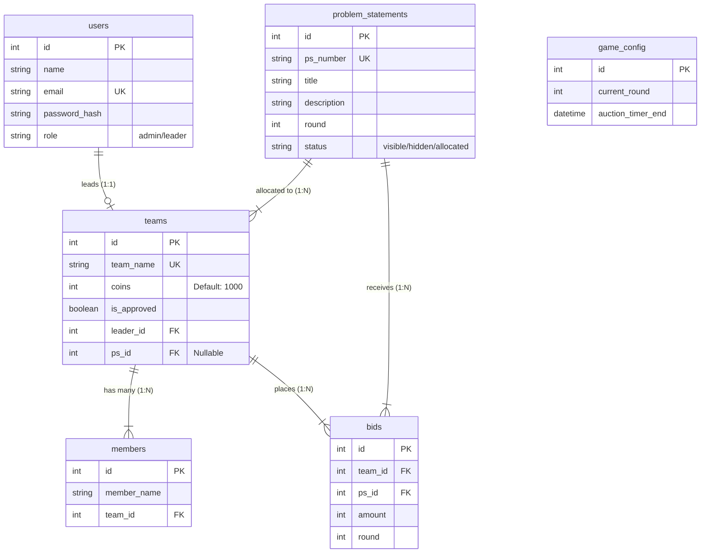
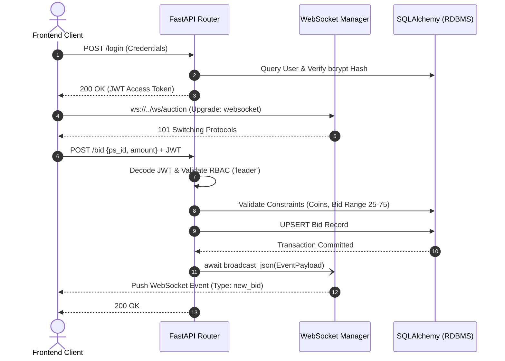

# Casino Hackathon - Backend Service Architecture

This repository contains the backend service for the **Casino Hackathon Auction Platform**. The service is designed as a monolithic RESTful API with real-time bidirectional communication capabilities, built upon a modern, asynchronous Python stack.

## 🛠️ Technology Stack & Architecture

- **Framework**: **FastAPI** (ASGI web framework) ensuring high-throughput, low-latency API endpoints through asynchronous event loop (`asyncio`) processing.
- **ORM & Data Persistence**: **SQLAlchemy 2.0** backed by PostgreSQL, with ACID transactions, row locking, connection pooling, and Alembic schema migrations. SQLite is used only as the read-only source during the one-time legacy data transfer.
- **Server Gateway**: **Uvicorn**, a lightning-fast ASGI implementation leveraging `uvloop` and `httptools`.
- **Authentication**: Stateless authentication using **JSON Web Tokens (JWT)** secured via HMAC-SHA256 (`HS256`) signature algorithms. Password persistence utilizes `passlib` with `bcrypt` salting and hashing.
- **Real-time Engine**: **WebSockets** protocol (RFC 6455) for asynchronous, full-duplex communication enabling sub-second event broadcasts.

## 🧠 Core Domain Logic & Modules

### 1. Identity & Access Management (IAM)
- **Role-Based Access Control (RBAC)**: The system enforces strict segregation of duties between `admin` and `leader` roles using FastAPI dependency injection (`Depends()`).
- **Authorization Flow**: 
  1. Client transmits credentials payload to `POST /login`.
  2. Server validates bcrypt hash and issues a short-lived stateless JWT access token.
  3. Subsequent protected route requests require the `Authorization: Bearer <token>` header, verified middleware-style before request processing.

### 2. Auction & Bidding Engine (Core Logic)
- **State Management**: The auction's temporal state (e.g., active round, timer bounds) is tracked via the `GameConfig` singleton model.
- **Validation Constraints**: 
  - Dynamic constraints ensure a bid payload (`amount`) strictly adheres to the bounds: `25 <= amount <= 75`.
  - Referential integrity checks guarantee the team possesses sufficient `coins` and the `ProblemStatement` status is `visible`.
- **Resolution Algorithm**: Upon round termination (`POST /admin/end-round`), the engine executes an aggregation query to determine the max `amount` per `ps_id`. The winning team undergoes a transactional atomic operation deducting the respective coin balance and updating the PS `status` to `allocated`.

### 3. Asynchronous Event Broadcasting
- **WebSocket Connection Manager**: A robust connection manager handles TCP connection state (`connect`, `disconnect`).
- **Event-Driven Pub/Sub**: Stateful mutation endpoints (`place_bid`, `start_round`, `end_round`) execute `await manager.broadcast_json()` immediately post-commit, multiplexing JSON-serialized event payloads to all active WebSocket clients. This mitigates frontend polling overhead and minimizes UI latency.

## 🗄️ Relational Database Schema (ERD)

The persistence layer uses a normalized relational model. Below is the Entity-Relationship Diagram representing table structures and foreign key constraints.



## 🔄 System Architecture Flow



## 📡 API Reference & Endpoints

The backend exposes a comprehensive set of RESTful endpoints. Authentication is handled via the `Authorization: Bearer <token>` header.

### Authentication & IAM
- `POST /signup` - Registers a new team and creates the leader account.
- `POST /login` - Authenticates user credentials and issues a JWT token.

### Team Management
- `GET /dashboard` - Retrieves the authenticated leader's team data, coin balance, and members. *(Leader Only)*
- `GET /teams` - Retrieves a list of all registered teams. *(Admin Only)*
- `PUT /team/{team_id}/approve` - Approves a team for auction participation. *(Admin Only)*
- `DELETE /team/{team_id}` - Deletes a team and its associated leader account. *(Admin Only)*

### Auction & Bidding
- `GET /problem-statements` - Retrieves all visible problem statements.
- `POST /problem-statement` - Creates a new problem statement. *(Admin Only)*
- `POST /bid` - Places or updates a bid on a specific problem statement. Payload: `{"ps_id": int, "amount": int}` (Range: 25-75). *(Leader Only)*
- `GET /bid-history` - Retrieves the entire ledger of bids. *(Admin Only)*

### Round Control & Leaderboard
- `POST /admin/start-round` - Initializes a new auction round with a specified timer. *(Admin Only)*
- `POST /admin/end-round` - Terminates the round, executes the resolution algorithm to find highest bidders, deducts coins, and allocates problem statements. *(Admin Only)*
- `GET /leaderboard` - Renders the current standings and coin balances of all teams. *(Admin/Global)*

### Real-time Communication
- `WS /ws/auction` - Upgrades the HTTP connection to a WebSocket for pushing live events (`new_bid`, `round_started`, `round_ended`).

## 🚀 Deployment Instructions

Production schema changes are managed by Alembic. For the one-time SQLite to
PostgreSQL cutover, follow [POSTGRESQL_MIGRATION.md](POSTGRESQL_MIGRATION.md).

1. Instantiate a virtual environment and resolve dependencies:
   ```bash
   python -m venv venv
   source venv/bin/activate  # Or `venv\Scripts\activate` on Windows
   pip install -r requirements.txt
   alembic upgrade head
   ```
2. Initialize the ASGI application worker:
   ```bash
   uvicorn app.main:app --host 0.0.0.0 --port 8000 --reload
   ```
3. The OpenAPI (Swagger) specification is auto-generated and accessible at: `http://127.0.0.1:8000/docs`
